## Part 1. Готовый докер

- Взять официальный докер образ с nginx и выкачать его при помощи `docker pull`  
	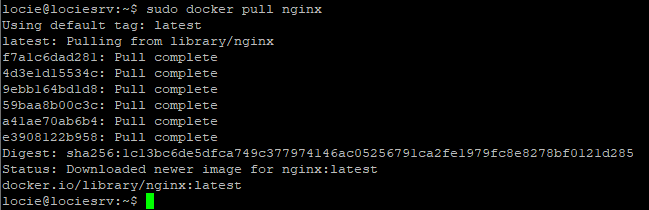

- Проверить наличие докер образа через `docker images`  
	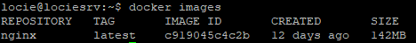

- Запустить докер образ через `docker run -d [image_id|repository]`  
	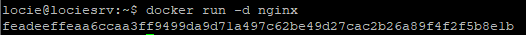

- Проверить, что образ запустился через `docker ps`  
	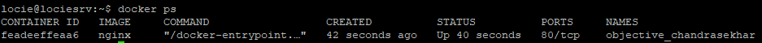
- Посмотреть информацию о контейнере через `docker inspect 
[container_id|container_name]`. По выводу команды определить и поместить в отчёт:  
	* размер контейнера: _Size: 141505630 B_
	* список замапленных портов: _Ports: 80/tcp: null_
	* ip контейнера: _IPAddress: 172.17.0.2_  

-  Остановить докер образ через `docker stop [container_id|container_name]`  
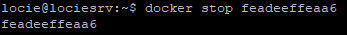

- Проверить, что образ остановился через `docker ps`  
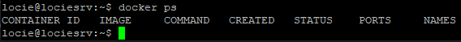

- Запустить докер с замапленными портами __80__ и __443__ на локальную машину через команду `run`  
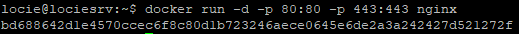

- Проверить, что в браузере по адресу _localhost:80_ доступна стартовая страница _nginx_  
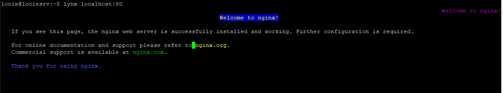

- Перезапустить докер образ через `docker restart [image_id|repository]`  
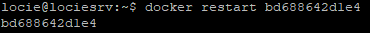

- Проверить любым способом, что контейнер запустился  
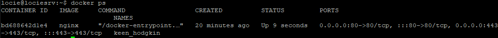

## Part 2. Операции с контейнером

- Прочитать конфигурационный файл _nginx.conf_ внутри докер образа через команду `exec`  
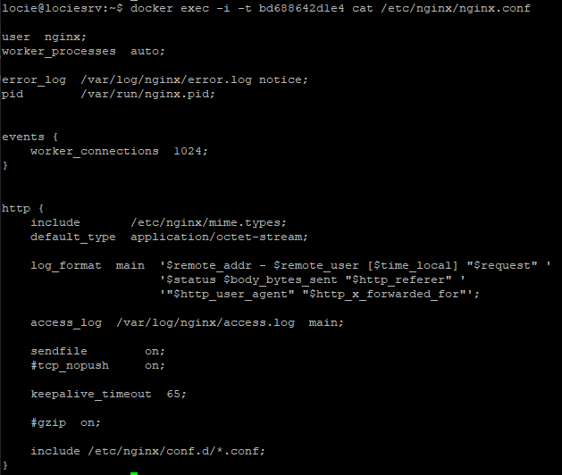

- Создать на локальной машине файл _nginx.conf_.  
Настроить в нем по пути _/status_ отдачу страницы статуса сервера nginx  
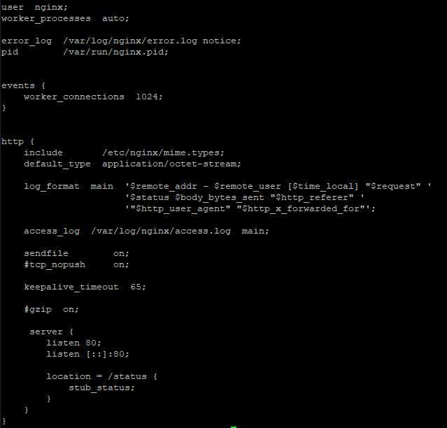

- Скопировать созданный файл _nginx.conf_ внутрь докер образа через команду `docker cp`  
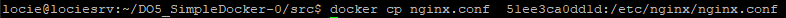

- Перезапустить nginx внутри докер образа через команду `exec`  
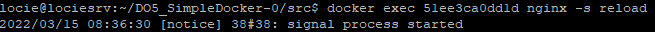

- Проверить, что по адресу _localhost:80/status_ отдается страничка со статусом сервера nginx  
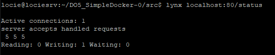

- Экспортировать контейнер в файл _container.tar_ через команду `export`  
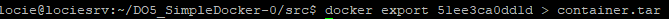

- Остановить контейнер  
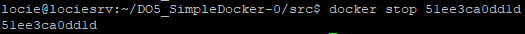

- Удалить образ через `docker rmi [image_id|repository]`, не удаляя перед этим контейнеры  
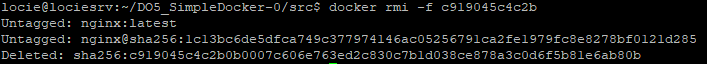

- Импортировать контейнер обратно через команду `import`  
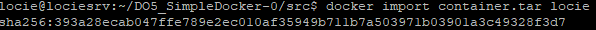

- Запустить импортированный контейнер  
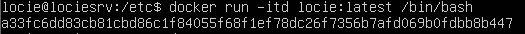

## Part 3. Мини веб-сервер

- Написать мини сервер на _C_ и _FastCgi_, который будет возвращать простейшую страничку с надписью _Hello World!_  
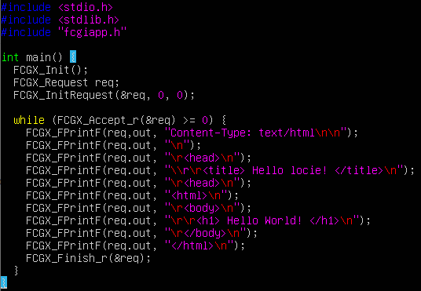

- Написать свой _nginx.conf_, который будет проксировать все - запросы с __81__ порта на __127.0.0.1:8080__  
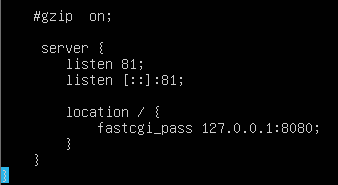

- Положить файл _nginx.conf_ по пути _./nginx/nginx.conf_, также копируем _minisrv.c_  
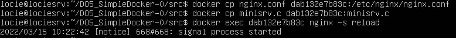

- Запустить написанный мини сервер через `spawn-cgi` на порту __8080__  
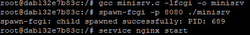

- Проверить, что в браузере по __localhost:81__ отдается написанная вами страничка
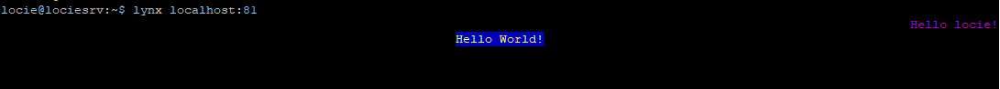

## Part 4. Свой докер

- Написать свой докер образ, который:
1) собирает исходники мини сервера на FastCgi из Части 3
2) запускает его на 8080 порту
3) копирует внутрь образа написанный ./nginx/nginx.conf
4) запускает nginx.
nginx можно установить внутрь докера самостоятельно, а можно воспользоваться готовым образом с nginx'ом, как базовым.
Dockerfile:  
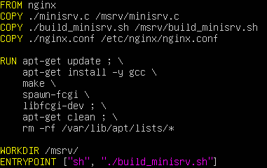

- Собрать написанный докер образ через docker build при этом указав имя и тег  
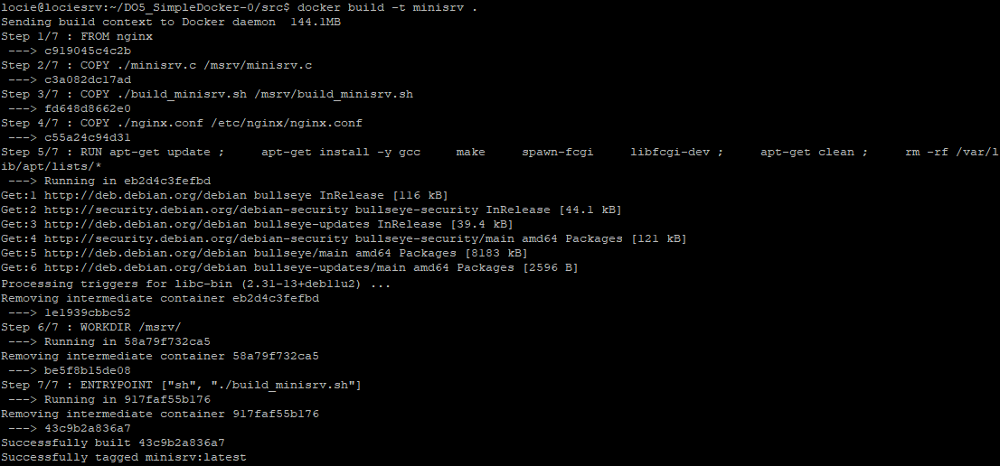

- Проверить через docker images, что все собралось корректно  
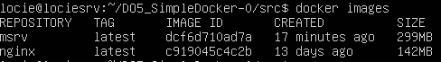

- Запустить собранный докер образ с маппингом 81 порта на 80 на локальной машине и маппингом папки ./nginx внутрь контейнера по адресу, где лежат конфигурационные файлы nginx'а (см. Часть 2)  

- Проверить, что по localhost:80 доступна страничка написанного мини сервера  
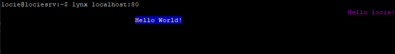

- Дописать в ./nginx/nginx.conf проксирование странички /status, по которой надо отдавать статус сервера nginx  
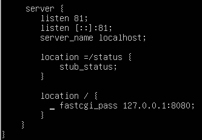

- Перезапустить докер образ. Если всё сделано верно, то, после сохранения файла и перезапуска контейнера, конфигурационный файл внутри докер образа должен обновиться самостоятельно без лишних действий. Проверить, что теперь по localhost:80/status отдается страничка со статусом nginx  
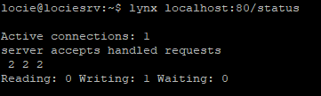

## Part 5. Dockle
- Установка dockle на Ubuntu:  
`VERSION=$(curl --silent "https://api.github.com/repos/goodwithtech/dockle/releases/latest" | grep '"tag_name":' | sed -E 's/.*"v([^"]+)".*/\1/') && curl -L -o dockle.deb https://github.com/goodwithtech/dockle/releases/download/v${VERSION}/dockle_${VERSION}_Linux-64bit.deb`  
$ `sudo dpkg -i dockle.deb && rm dockle.deb`

- Просканировать контейнер из предыдущего задания через `dockle [container_id|container_name]`  
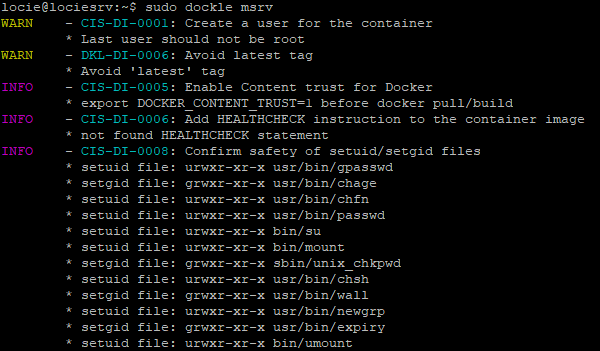

- Исправить контейнер так, чтобы при проверке через dockle не было ошибок и предупреждений  
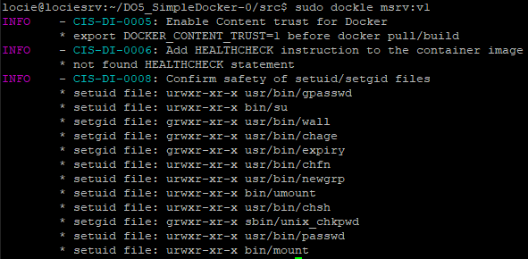

## Part 6. Базовый Docker Compose

- Написать файл docker-compose.yml:  
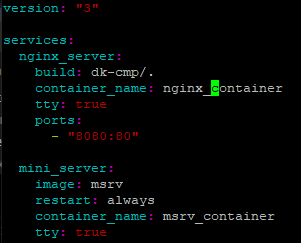

- Собрать и запустить проект с помощью команд docker-compose build и docker-compose up  
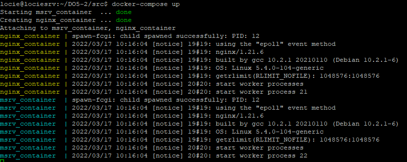

- Проверить, что в браузере по localhost:80 отдается написанная вами страничка, как и ранее  

